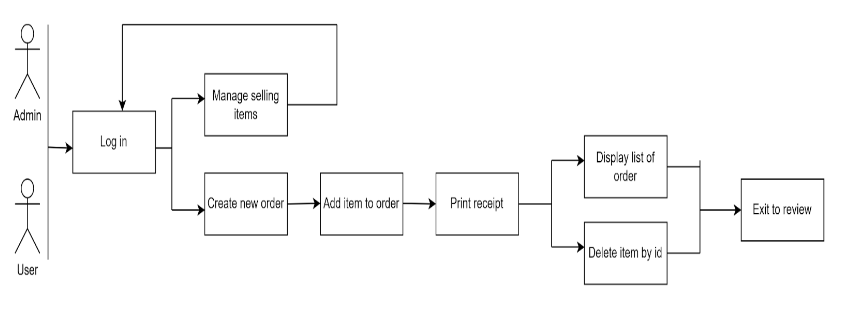

# Order Management Application
A simple GUI application for bookstore management, developed using Java and JavaFX.

## Objectives
* To offer the user an interactive user experience so they can quickly and easily purchase their favourite book,CD or DVD.
* To offer a straightforward method for managing orders effectively while signed in as the application's administrator, allowing access to change and remove them.

## Features
* User login and signup
* Simple order placing with the help of user-friendly UI.
* Manage orders option for admin.

